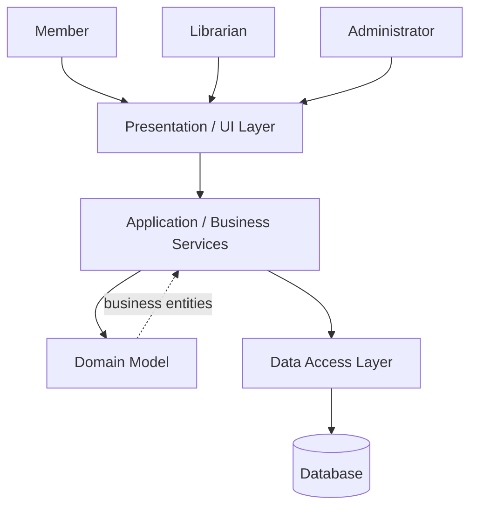
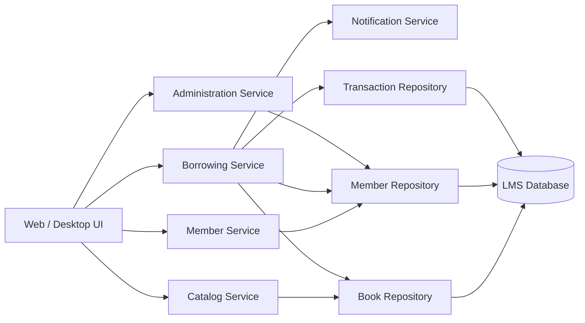

# 2. System Architecture Design

## Architectural Style

The proposed LMS uses a layered architecture.

### Presentation / UI Layer

Responsibilities:

- display catalog information;
- receive user input;
- provide librarian/member screens;
- call application services.

### Business / Application Layer

Responsibilities:

- execute borrowing and return workflows;
- validate business rules;
- coordinate domain objects;
- manage transactions.

### Domain Layer

Contains the core business objects:

- Book
- Member
- Librarian
- BorrowTransaction

### Data Access Layer

Responsibilities:

- store and retrieve books;
- store and retrieve users;
- store and retrieve borrowing transactions;
- isolate persistence logic from business logic.

### Database

Stores persistent LMS information.

## High-Level Architecture

## Major Components

## Component Interaction Example — Borrowing

1. Member requests a book from the UI.
2. UI sends the request to BorrowingService.
3. BorrowingService retrieves Member and Book.
4. Business rules are validated.
5. Book state changes from Available to Issued.
6. BorrowTransaction is created.
7. Repositories persist the changes.
8. UI receives a success or failure response.

## Design Principles

### Separation of Concerns

UI, business logic, domain rules, and persistence are separated.

### Single Responsibility

Examples:

- `CatalogService` handles catalog operations.
- `BorrowingService` handles borrowing workflows.
- `BookRepository` handles book persistence.

### Dependency Direction

Higher-level business services depend on repository abstractions rather than directly accessing a database.
