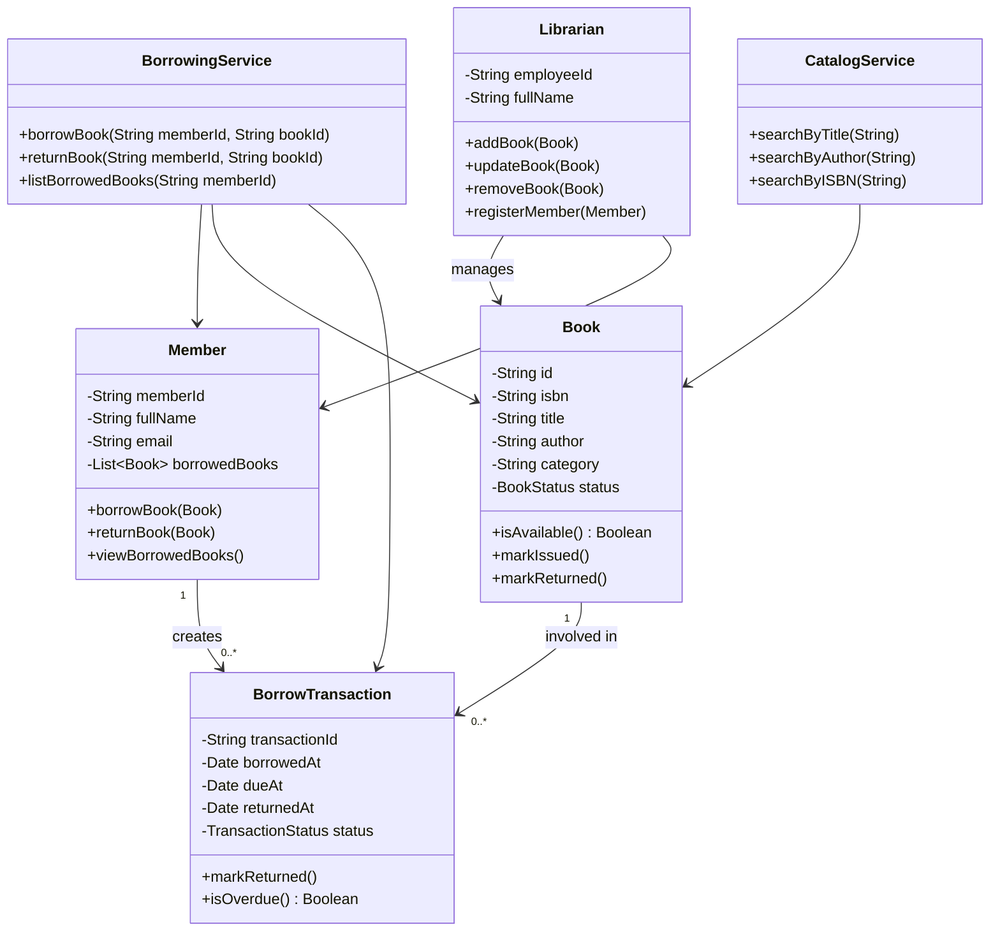
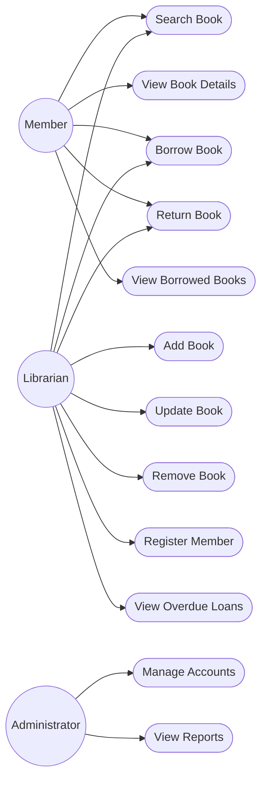

# 3. Object-Oriented Analysis

## Identified Classes

### Book

**Attributes**

- id
- isbn
- title
- author
- category
- status

**Methods**

- isAvailable()
- markIssued()
- markReturned()

### Member

**Attributes**

- memberId
- fullName
- email
- borrowedBooks

**Methods**

- borrowBook()
- returnBook()
- viewBorrowedBooks()

### Librarian

**Attributes**

- employeeId
- fullName

**Methods**

- addBook()
- updateBook()
- removeBook()
- registerMember()
- issueBook()
- receiveBook()

### BorrowTransaction

**Attributes**

- transactionId
- memberId
- bookId
- borrowedAt
- dueAt
- returnedAt
- status

**Methods**

- markReturned()
- isOverdue()

### CatalogService

**Methods**

- searchByTitle()
- searchByAuthor()
- searchByISBN()
- getBookDetails()

### BorrowingService

**Methods**

- borrowBook()
- returnBook()
- listBorrowedBooks()
- findOverdueTransactions()

## Class Diagram

## Use Case Diagram

