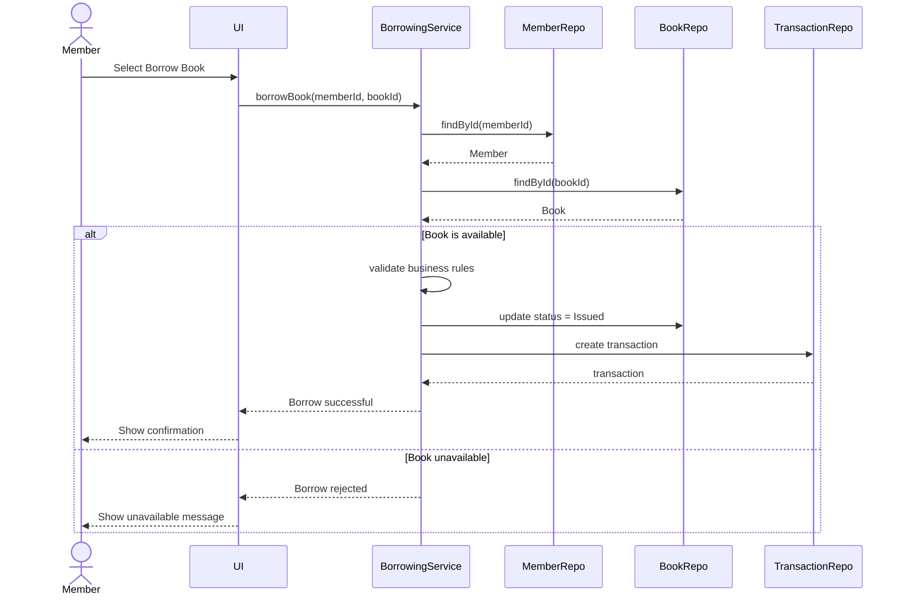
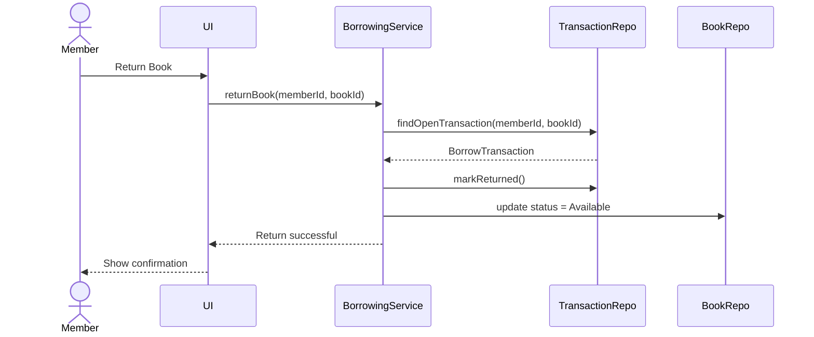
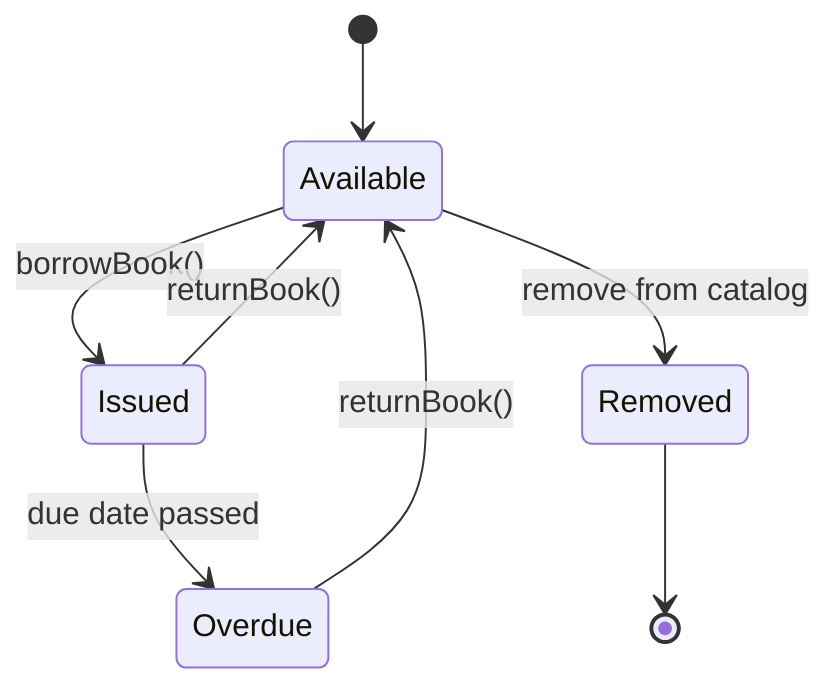

# 4. Behavioral Models

## Sequence Diagram — Borrow Book

## Sequence Diagram — Return Book

## Book State Diagram

## Behavioral Rules

### Available

The book can be borrowed.

### Issued

The book has an active borrowing transaction and cannot be borrowed again.

### Overdue

The due date has passed while the borrowing transaction remains open.

### Removed

The book is no longer available through the catalog.
