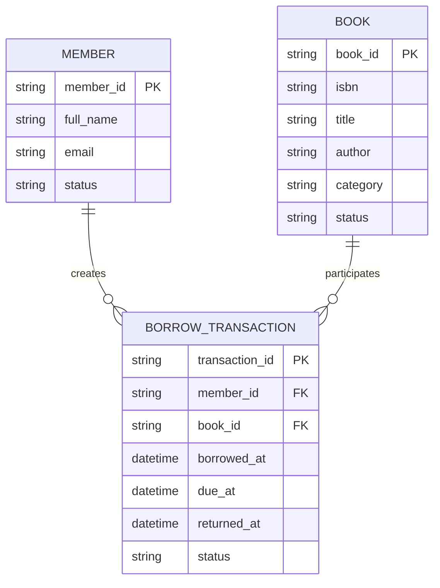

# 5. Data, Functional, and Behavioral Modeling

## Data Model

### Entities

#### BOOK

| Field | Type | Description |
|---|---|---|
| book_id | identifier | Unique book record |
| isbn | string | ISBN |
| title | string | Book title |
| author | string | Author |
| category | string | Category |
| status | enum | Available, Issued, Overdue, Removed |

#### MEMBER

| Field | Type | Description |
|---|---|---|
| member_id | identifier | Unique member |
| full_name | string | Member name |
| email | string | Contact email |
| status | enum | Active / Suspended |

#### BORROW_TRANSACTION

| Field | Type | Description |
|---|---|---|
| transaction_id | identifier | Unique transaction |
| member_id | foreign key | Member |
| book_id | foreign key | Book |
| borrowed_at | datetime | Borrow date |
| due_at | datetime | Due date |
| returned_at | datetime/null | Return date |
| status | enum | Open, Overdue, Returned |

## Entity Relationship Model



# Functional Model

## Search Book

**Input:** search term

**Process:**

1. Receive search criteria.
2. Query catalog.
3. Match title, author, or ISBN.
4. Return matching books.

**Output:** list of books.

## Borrow Book

**Input:**

- memberId
- bookId

**Process:**

1. Validate member.
2. Retrieve book.
3. Confirm availability.
4. Mark book as issued.
5. Create transaction.
6. Save changes.

**Output:**

- success confirmation, or
- business-rule error.

## Return Book

**Input:**

- memberId
- bookId

**Process:**

1. Find open transaction.
2. Mark transaction returned.
3. Mark book available.
4. Save changes.

**Output:** return confirmation.

# Behavioral Model

The system changes state in response to events.

Examples:

```text
Book Borrowed
Available -> Issued

Due Date Passed
Issued -> Overdue

Book Returned
Issued/Overdue -> Available
```

The behavioral model is represented in greater detail by the state and sequence diagrams in `04-behavior-models.md`.
