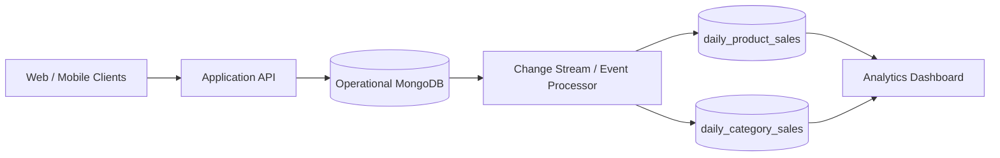
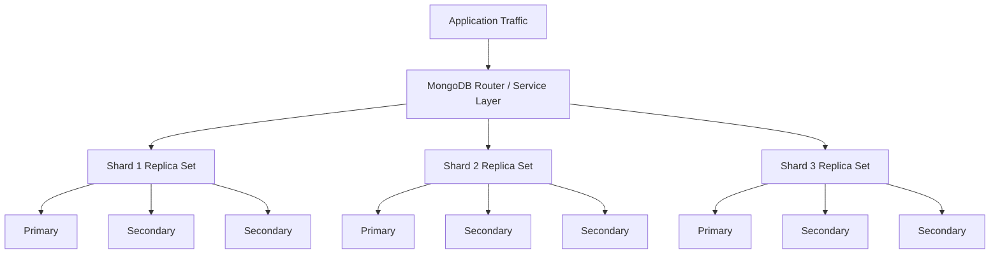

# Refactored Schema for Analytics and High Availability

## 1. New Requirement View

The system must now support:

- large-scale product/sales analytics;
- higher user volume;
- high availability;
- partition tolerance;
- continued transactional performance.

The original operational model is still useful, but analytical scans should not compete with customer-facing order traffic.

## 2. Refactoring Strategy

The refactor combines three techniques:

### Sharding

Operational collections are horizontally partitioned to distribute reads, writes, and storage across multiple nodes.

### Replication

Each shard is backed by a replica set. Replica members provide redundancy and automatic failover.

### Denormalized Analytical Read Models

Analytics collections store pre-aggregated results so dashboards do not repeatedly scan the full order history.

## 3. Refactored Operational Collections

### `products`

The product document stays largely unchanged because browse/search access patterns remain valid.

A shard strategy can use a hashed `_id` for even distribution when the dominant workload is product-by-ID traffic, while search remains served through indexed/search infrastructure.

### `orders`

The order document remains the transactional source of truth.

For high write throughput, orders are partitioned using a high-cardinality shard key. One practical design is:

```text
{ customerId: "hashed" }
```

This spreads customers across shards and keeps per-customer workloads scalable.

Where global time-window queries are dominant, a compound strategy may be evaluated to balance distribution and query targeting. Shard-key selection must reflect measured production traffic rather than a purely theoretical rule.

## 4. New Analytical Collections

### `daily_product_sales`

```json
{
  "_id": {
    "date": "2026-08-19",
    "productId": "ObjectId"
  },
  "sku": "LAP-001",
  "productName": "Ultrabook Pro 14",
  "categoryId": "computers",
  "unitsSold": 1874,
  "grossRevenue": 2434526.00,
  "orderCount": 1699,
  "averageUnitPrice": 1299.00,
  "updatedAt": "ISODate"
}
```

### `daily_category_sales`

```json
{
  "_id": {
    "date": "2026-08-19",
    "categoryId": "computers"
  },
  "unitsSold": 12950,
  "grossRevenue": 8850000.00,
  "orderCount": 10140,
  "topProducts": [
    {
      "productId": "ObjectId",
      "sku": "LAP-001",
      "unitsSold": 1874
    }
  ],
  "updatedAt": "ISODate"
}
```

These documents trade extra write/storage cost for much faster analytical queries.

## 5. Data Flow



The operational database remains optimized for transactions, while analytics queries use derived read models.

## 6. High Availability Architecture



## 7. Consistency Model After Refactoring

Transactional order state should use stronger consistency semantics.

Analytics read models are allowed to be eventually consistent because being a few seconds behind the operational order store is acceptable for trend dashboards.

This separation prevents an unnecessary requirement for globally strong consistency on every workload.

## 8. Benefits

The refactor improves:

- write scalability through sharding;
- fault tolerance through replication;
- analytical query latency through pre-aggregation;
- workload isolation between operational traffic and reporting;
- availability during individual node failures.

## 9. Trade-offs

The refactor introduces:

- duplicated data;
- more complex operational topology;
- eventual consistency between operational and analytical views;
- additional monitoring and data-pipeline responsibilities;
- shard-key design risk if access patterns are misunderstood.

The correct design is therefore not "maximum consistency everywhere." It is a workload-aware balance between correctness, availability, and performance.
