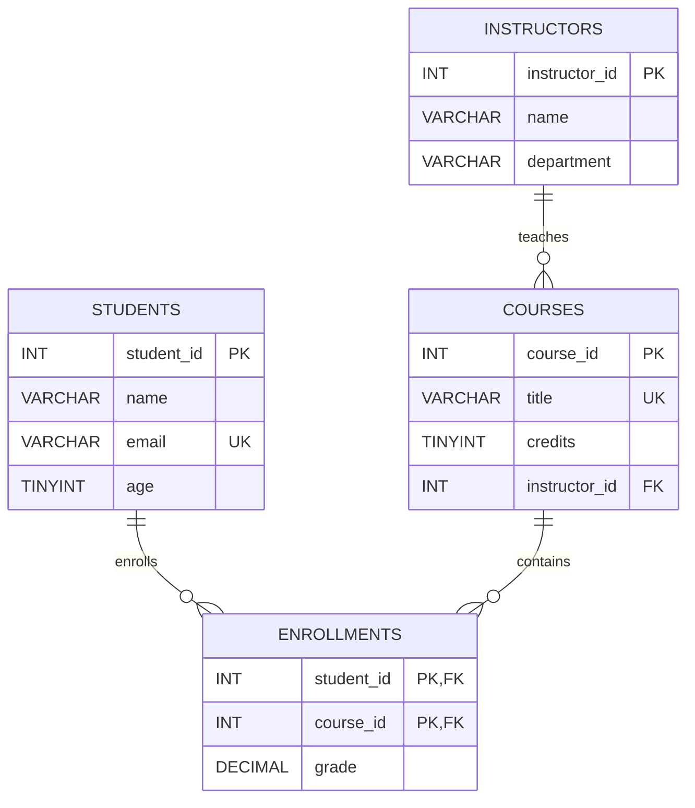

# Relational Schema Diagram

```mermaid
erDiagram
    STUDENTS ||--o{ ENROLLMENTS : enrolls
    COURSES ||--o{ ENROLLMENTS : contains
    INSTRUCTORS ||--o{ COURSES : teaches

    STUDENTS {
        INT student_id PK
        VARCHAR name
        VARCHAR email UK
        TINYINT age
    }

    INSTRUCTORS {
        INT instructor_id PK
        VARCHAR name
        VARCHAR department
    }

    COURSES {
        INT course_id PK
        VARCHAR title UK
        TINYINT credits
        INT instructor_id FK
    }

    ENROLLMENTS {
        INT student_id PK,FK
        INT course_id PK,FK
        DECIMAL grade
    }
```

## Cardinalities

- Instructor 1 -> many Courses
- Student many <-> many Course through Enrollment
- One Enrollment belongs to exactly one Student and one Course
